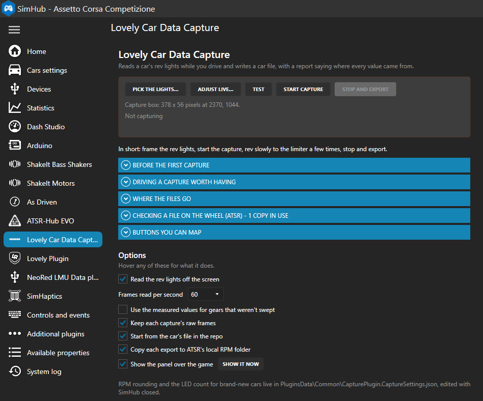
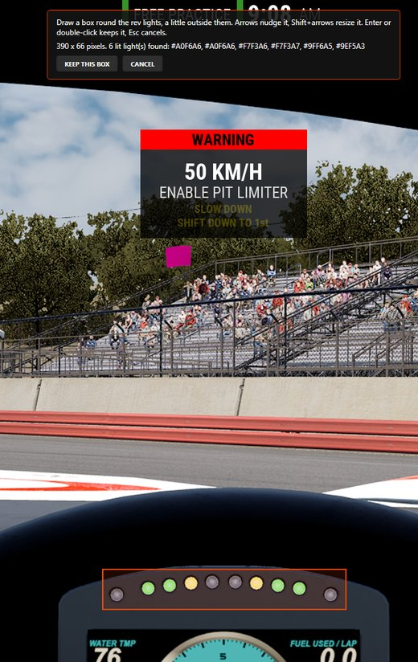
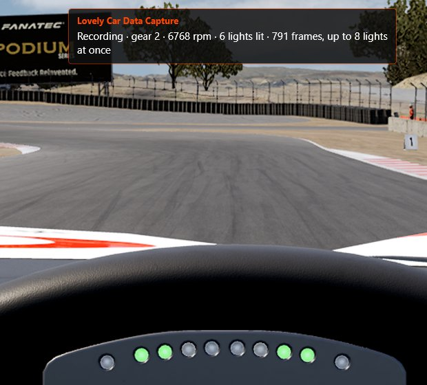
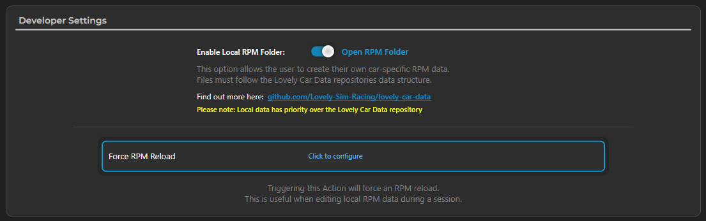
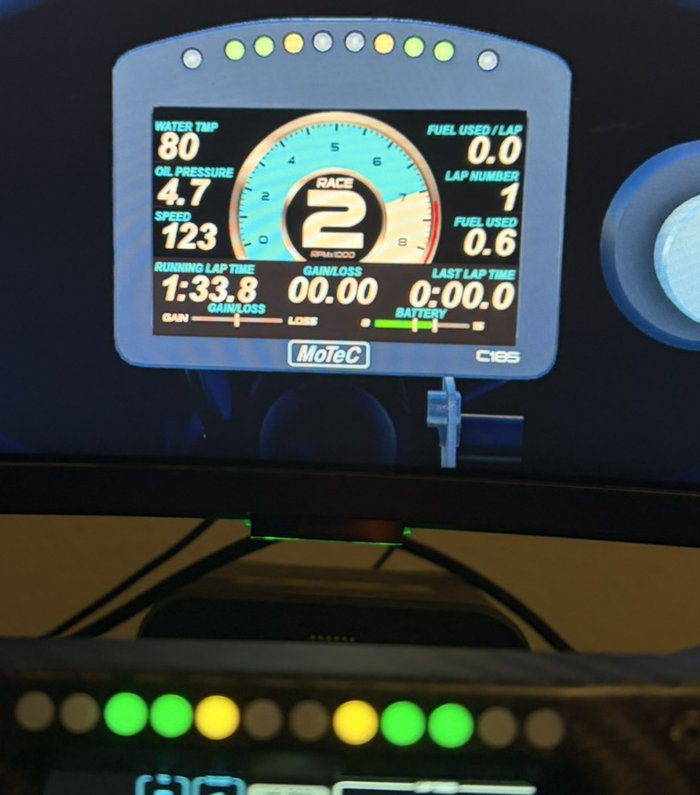

# Lovely Car Data Capture

A SimHub plugin that measures a car's rev lights while you drive and writes a
[Lovely Car Data](https://github.com/Lovely-Sim-Racing/lovely-car-data) car file: the RPM each light
comes on at, their colours, the redline and whether the strip blinks. A report explains where every
value came from.

In AMS2, ACC, LMU, PMR, AC, AC EVO and most other games it reads the lights off the screen. In F1 and iRacing it
reads them from telemetry.

*A community tool, not made by or affiliated with Lovely Sim Racing or ATSR.*

## Install

Current release: [v0.2.2](https://github.com/Milky28/lovely-car-data-capture/releases/tag/v0.2.2),
with screen detection fixes for lights that blow out, drift in colour or only light at the redline. See the [changelog](CHANGELOG.md) for details.

1. Download `LovelyCarDataCapture.dll` from the [latest release](https://github.com/Milky28/lovely-car-data-capture/releases/latest).
2. Close SimHub and copy the DLL into the SimHub folder (usually `C:\Program Files (x86)\SimHub`).
3. Start SimHub and enable **Lovely Car Data Capture** when asked. Its page is under
   **Additional plugins** in SimHub's left menu.

Not listed? Right-click the DLL, choose *Properties*, tick *Unblock*, and start SimHub again.



## Your first capture

Run the game **borderless or windowed**, and turn off head movement and camera shake.

1. **Sit in the car** with the rev lights in view.
2. On the plugin's page press **Pick the lights…**, then switch to the game. Five seconds later it
   takes a still of the screen: draw a box round the lights, a little outside them, and press Enter.
   The banner says how many lit lights it finds in the box.

   
3. Press **Start capture**.
4. **Rev slowly from idle to the limiter**, three or four times, in two or three gears. Hold the
   limiter for a second or two each time. Braking mid-sweep is fine. In a game whose wheel turns
   with yours, or that shows its lights well behind the revs (PMR), rev slowly in neutral instead,
   hands off the wheel. A panel over the game shows
   what's being recorded.

   
5. If SimHub cannot report the car's gear count and you could not reach the higher gears, set
   **Top gear for next export** to the car's highest forward gear (1–12). Unreached gears use
   fallback values; check the report and verify them in game. The choice resets to **Auto** after
   a successful export.
6. Press **Stop and export**.

The car file and its report are written to `Documents\SimHub\LovelyCarDataCapture\<game>\`.
Replacing an export saves its previous JSON and report in that game's `backups` folder first.
Gears not captured this time keep their previous RPM values. Confirmed color and blink adjustments
can be kept in a [local overrides file](docs/reference.md#keeping-confirmed-colors-and-blink-timing).
Forgot to stop? Closing SimHub exports a capture that's still running.
Read the report: it says what was measured, how tightly, what was left out and why. From the
Ginetta's:

```text
Gear 3: 8/8 lights seen, 688 rising frames
  LED  1    6295  4 climbs, agreeing within 22 rpm
  LED  2    6500  4 climbs, agreeing within 6 rpm; off at 6496, the two averaged
  LED  3    6700  3 climbs, agreeing within 13 rpm
  LED  4    6895  3 climbs, agreeing within 8 rpm
  ...
Colors measured on screen:
  LED 1, 2, 7, 8: rgb(158,245,165) -> green #FF00FF00
  LED 3, 6: rgb(246,242,165) -> yellow #FFFFFF00
  Redline color rgb(255,139,153) -> #FFFF0000 from 6895 rpm
```

Games that pause when they lose focus: map **StartCapture**, **StopAndExport** and
**PickCaptureBox** to wheel buttons in SimHub's *Controls and events*. A panel over the game
confirms each press.

## Check it on your wheel

If you use ATSR, you can see the new file on your wheel straight after the drive:

1. In ATSR, switch on **Enable Local RPM Folder** (ATSR-Hub EVO > Universal Settings > RPM Settings >
   Developer Settings). You don't need to bind Force RPM Reload: the plugin presses it for you.

   
2. On this plugin's page, tick **Copy each export to ATSR's local RPM folder**.

Each export then goes to your wheel as soon as it's saved. While a copy is there ATSR uses it instead
of the repo's file, so remove it from the plugin's page (*Checking a file on the wheel*) once you're done.

<p align="center">
  
  <br><em>ACC's Ginetta G55 GT4, a car new to the repo: the game's lights on screen, and the wheel below
  driven by ATSR from the file this plugin wrote.</em>
</p>

## Submit it

Open the file in the [RPM LED Builder](https://milky28.github.io/rpm-led-builder/) for a last look,
then contribute it to [Lovely Car Data](https://github.com/Lovely-Sim-Racing/lovely-car-data) as a
pull request.

## Games

| Game | How the lights are read | Tested |
| --- | --- | --- |
| AMS2, ACC, LMU, PMR, AC, AC EVO | Off the screen | Yes, against selected cars checked in game |
| RaceRoom | Off the screen | Capture and image regression tests; live wheel validation still needed |
| Other games | Off the screen | Not yet |
| F1 2021–2026, iRacing | Telemetry | Not yet in game |

## More

- [How it works](docs/how-it-works.md): what it works out from the screen, and how files are made to
  suit ATSR.
- [Reference](docs/reference.md): buttons, settings, SimHub properties and the ATSR local folder.
- [Development](docs/development.md): building, tests, and replaying a saved capture.

## License

MIT, see [LICENSE](LICENSE). Car files you contribute fall under Lovely Car Data's license.
